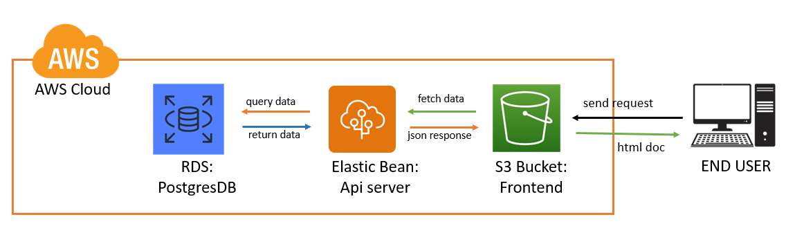

# Infrastructure
## AWS services 
### Elastic Beanstalk (EB)
- Hosting the Backend API App

### S3 Bucket
- Hosting the Frontend App

### RDSe
- Provide PostgresDB service

### Infastructure diagram:

