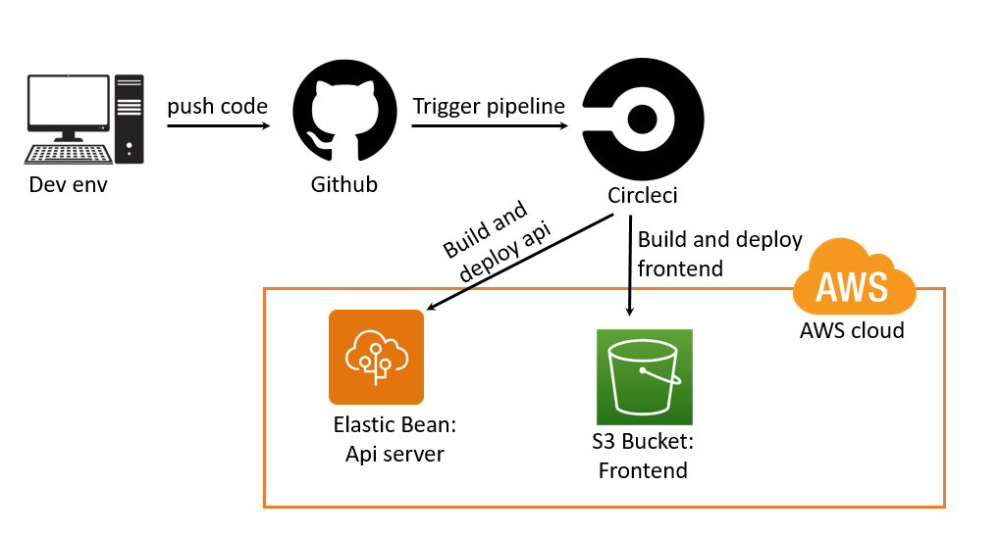

# Pipeline Process

1. Code is committed and pushed to repository on Github
2. The push trigger the pipeline on CircleCI
3. CircleCI execute the pipeline:
 3.1 Install dependencies and build Front-End app and API app
 3.2 Deploy the API app at AWS EB
 3.3 Deploy the Front-end app at AWS S3 Bucket

## Pipeline diagram

